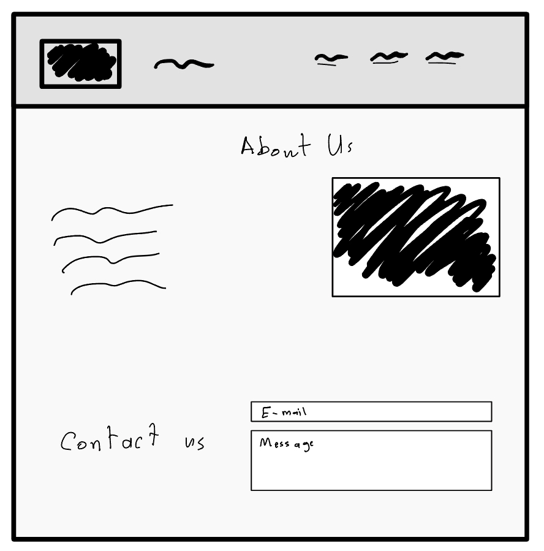
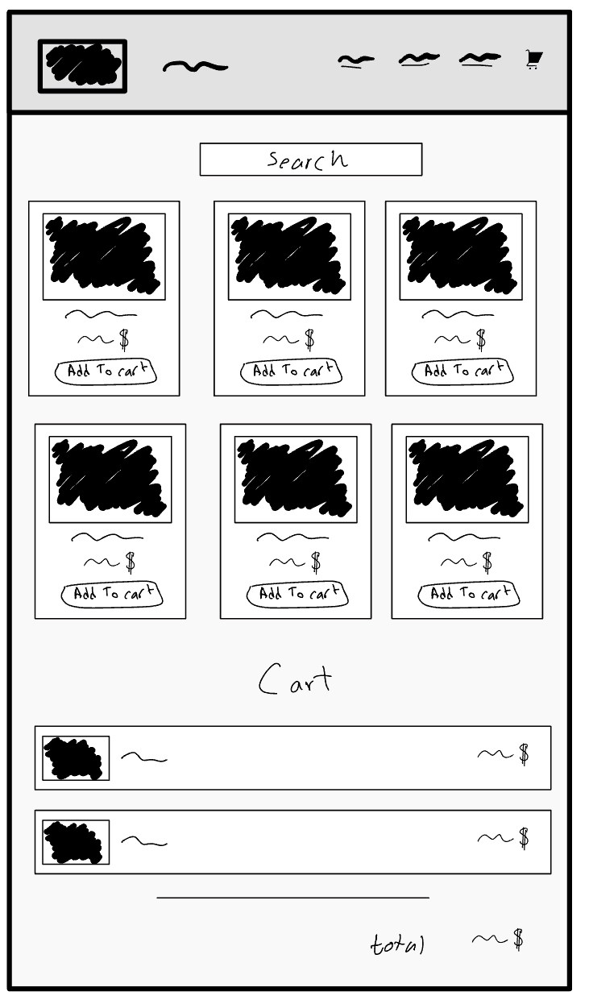

 

  <h1> الواجب الثالث 😍 </h1>
  <h3>في هذا الواجب ستقوم بصنع موقع E-commerce (المنتجات من اختيارك 😍 ورونا إبداعكم)</h3>
  
الصفحة الرئيسية 🏡:
1. شريط التنقل 
    - قم بإضافة الآتي في شريط التنقل :
      * اسم الموقع
      * شعار الموقع
      * رابط ينقلك الى صفحة "المنتجات"
      * رابط ينقلك إلى قسم "about us"
      * رابط ينقلك إلى قسم "contact us"
2. قسم  "about us"
3. قسم "contact us"
  
  <h1></h1>
صفحة  المنتجات 🧥:
  
1. شريط التنقل (نفس شريط التنقل الموجود في الصفحة الرئيسية)
2. أضف شريط بحث باستخدام input فوق المنتجات
3. أضف المنتجات  (أقل شي ٣ منتجات)
    - لكل منتج:
      * اسم
      * سعر
      * صورة
      * زر لإضافة المنتج  إلى السلة
4. أضف قسم للسلة كما في الصورة أدناه
   - أدرج قسم لحساب السعر الإجمالي (total)
  
  
جافاسكربت الموقع:
1. المنتجات تدرج عن طريق دالة forEach
2. اجعل المنتج يضاف إلى السلة عند الضغط على زر الإضافة (مع زر حذف المنتج من السلة دون تفعيلة)
3. احسب مجموع سعر المنتجات الموجودة في السلة

## بونص!🔥
* قائمة منسدلة Dropdown menu (bootstrap)
* أنميشن Animations
* أضف عداد في قسم السلة يحسب عدد المنتجات في قسم السلة
* قم بتفعيل زر إزالة المنتج من قسم السلة
* استخدم ما تعلمناه لتشغيل شريط البحث

